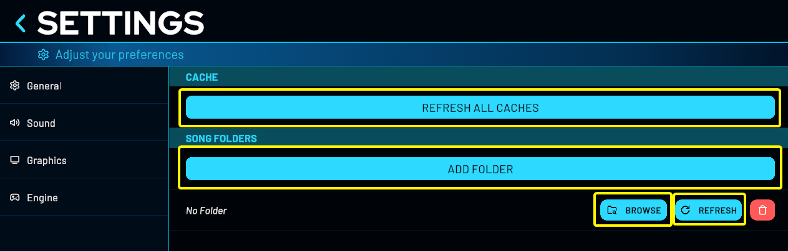
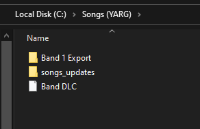
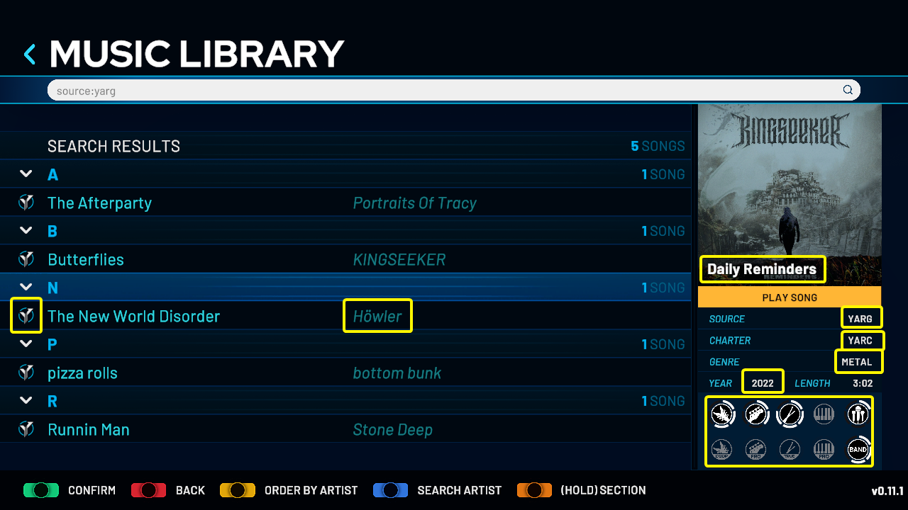

> We DO NOT encourage, advocate, or promote PIRATING of songs, or of anything else. This game's intended use is for you, the player, to play songs that you already own. This means, ripping songs of a game YOU OWN for YOURSELF for PERSONAL USE, or downloading creative commons/public domain songs off of the internet, or playing the built-in setlist.
{.is-info}

# 💿 Adding Songs
To add new songs into YARG you need to follow some simple steps
1. Go to **Settings**
1. Click the **Open Song Folder Manager**
1. Click on **Add Folder**, that will add a new empty folder slot in your library
1. Now click on **Browse** to select the path for your songs

## Song Scanning
After adding all your song folder you can click the Refresh All Caches; that will scan all your libraries.
If you added new songs to a specific song folder you can click the individual Refresh button to scan only that folder.

> We recommend adding a folder slot for each song folder you have, that will improve the song scanning and makes it easier to scan in case you add new songs.
{.is-info}

## Song Export
To export a list of your songs:
1. Go to **Settings**
1. Click on **All Settings**
1. Click on **File Management**
1. In the **Export** section, you can export a songs list in plain text or in Ouvert bot format.

# 🏷️ Formats

## .chart

## .mid

## CONs
YARG now supports extracted Rock Band CONs (referred to as "ex-cons"), as well as unextracted, straight CON files (the kind you would put in your Xbox 360 console). However, note that in order for them to load in-game, they MUST have decrypted .mogg files.

## songs_updates
Due to some legacy CONs missing metadata later added in RB3, YARG also supports updating these songs via a "songs_updates" folder placed in the root of your song folder. It is recommended you use the songs_updates from **RB3 Deluxe** as along with metadata updates, they contain song enhancements such as included harmonies and fixed pro drum tom markers.

> Both extracted and regular CONs will work with **songs_updates**
{.is-info}

# 🗂️ Music Library
## Sorting
Pressing `Orange Fret` will show a song selection menu:

- Random song: jump to a random song
- Back to top: jump to the top of the song selection menu
- Sort by:
Artist
Album
Artist
Genre
Year
Charter
Playlist: sorts by folder, then by band difficulty
Source
Duration
Date added
Playable songs: shows only songs with a playable part for all active profiles
Five fret guitar: shows only songs with a five fret guitar part
Five fret bass: shows only songs with a five fret bass part
Keys: shows only songs with a five-lane keys part
Four lane drums: shows only songs with a four-lane drum part
Pro drums: shows only songs with a pro drums part
Pro guitar (17-fret): shows only songs with a 17-fret pro guitar part
Pro guitar (22-fret): shows only songs with a 22-fret pro guitar part
Pro bass (17-fret): shows only songs with a 17-fret pro bass part
Pro bass (22-fret): shows only songs with a 22-fret pro bass part
Pro keys: shows only songs with a pro keys part
Vocals: shows only songs with a vocal part
Harmony: shows only songs with at least 2 vocal parts
Band difficulty
- Go to section: 0-9, A...Z
- Add to favorites
- View song folder: this opens the song folder in the operating system
- Copy song checksum

You can navigate between each header of the current sorting holding the `Orange Fret` and using `Up/Down`

## Filters
If you want to easily filter something you can also click on the filter you want to apply:

Our search bar accepts a few filter tags, here's a table with the current supported tags:
| Tag | Example |
| :--: | :--: |
| artist | `artist:bottom bunk` |
| album | `album:Drive Home` |
| genre | `genre:R&B/Soul/Fun` |
| year | `year:2023` |
| charter | `charter:YARC` |
| source | `source:YARG` |
| instrument | `instrument:guitar` |

You can also combine filters using `;` for example: `source:YARG;instrument:drums`

> For the instrument you can also use: **guitar**, **bass**, **drums**, **keys**, **vocals**, **harmVocals**, **realGuitar**, **realBass** and **band**
> You can also use **-guitar** for example to search for songs that don't have that instrument
{.is-info}

Another easy way to filter for specific artist is just pressing `Blue Fret` or `Blue Cymbal`, that will automaticaly filter using the artist of the selected song
Pressing again will filter by **source** of the selected song.

## Sources
We have our own source library maintained by the community, containing sources from base games, DLCs, charters, packs, and customs.
If you're interested in creating icons or adding new sources, check our repository for full guidelines:

- [📑 Repository *Guidelines on how to add new sources*](https://github.com/YARC-Official/OpenSource)
- [🔎 Webviewer *Easiest way to visualize our current sources*](https://opensource.yarg.in/)
{.links-list}

# 🗂️ Related Articles

- [💽 Official Setlist *Information about our Official Setlist*](/songs/Setlist)
- [🎼 Charting Guidelines *Some guidelines on how to chart for YARG*](/songs/charting)
{.links-list}

---

Credits to **RazQ** for the help on songs_updates
