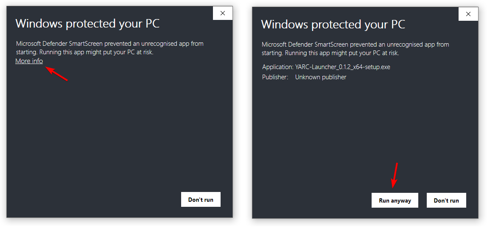
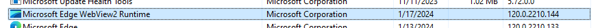
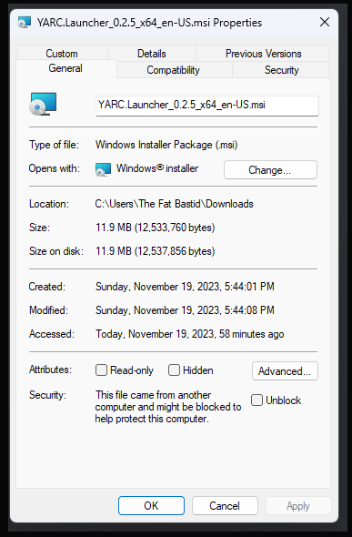

# "Windows protected your PC" popup

Windows may show a popup when you first try to install and/or run the launcher. In some instances, Windows will flag the launcher as “unrecognised” as it is not ran by Windows users frequently. To get around this, click on “More info” and then press the “Run anyway” button, as seen below:

# Various installation problems

If you're having trouble installing and starting the launcher, review the possible issues below to see if they apply to you.

## Be sure Webview2 is properly installed

The YARC Launcher relies on WebView2, as it uses [Tauri](https://tauri.app). WebView2 comes pre-installed with Windows 10 and 11.

In “Control Panel” → “Programs and features” check for “Microsoft Edge WebView2 Runtime”

Right click on it, select “Change”, and do a repair install.

## Be sure “Unblock” is checked in the launcher installer properties

Be sure “Unblock” is checked, here it is not checked.

## Be sure your anti-virus is not stopping the execution of the launcher or installer

The YARC Launcher may get some antivirus warnings from Windows Defender, along with other antiviruses. This is a false-positive! YARC Launcher is not a virus. The main reason for this is that the YARC Launcher is not certified with Microsoft, which immediately deems the program suspicious in some antiviruses. As this application increases in popularity, some antiviruses may start to trust the launcher more, and in which case, no issues will be found.
